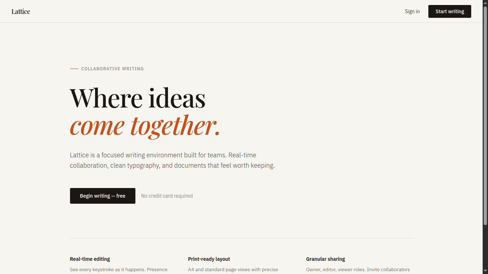
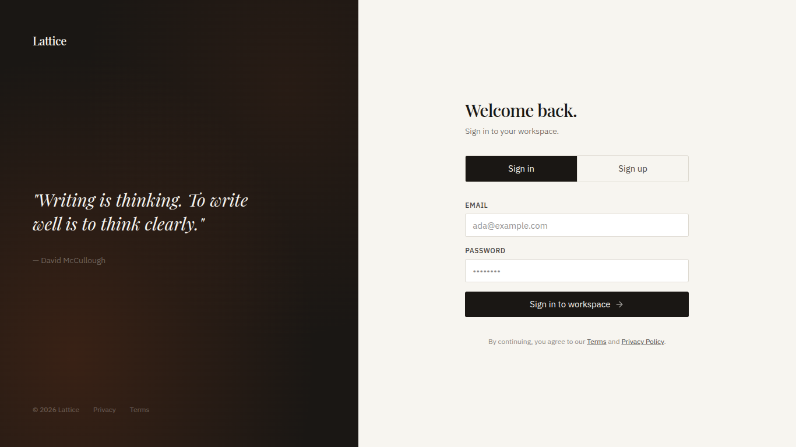
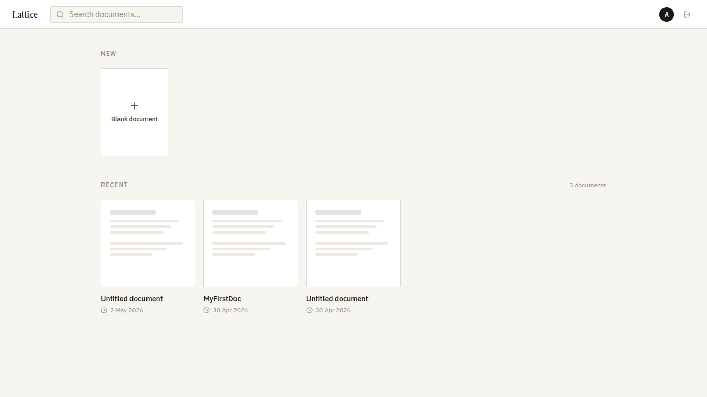
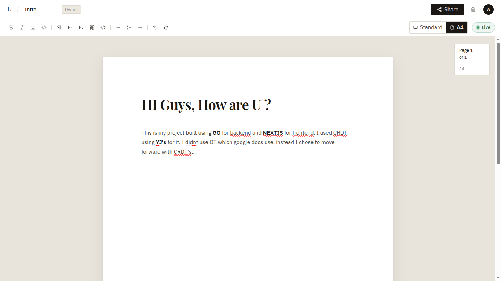
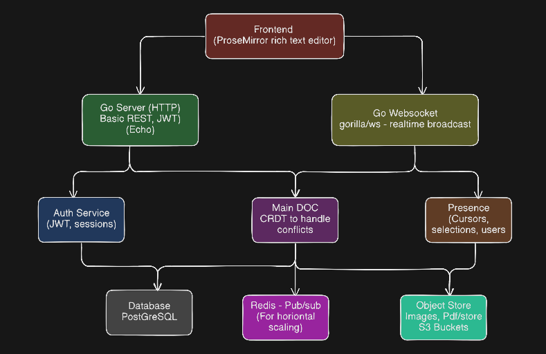
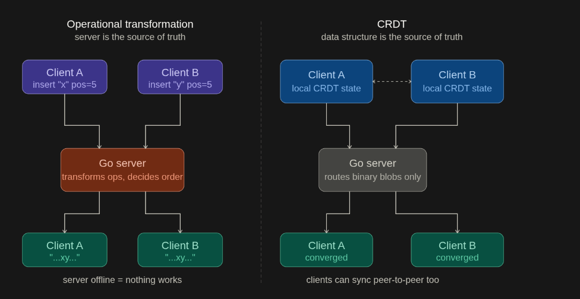
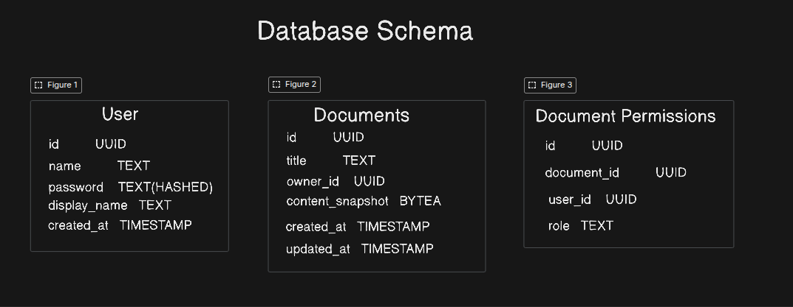

<p align="center">
  
</p>

# Lattice

Lattice is a real-time collaborative document editor built with a Go microservice backend and a Next.js frontend. It combines Yjs CRDTs for conflict-free editing, Redis Pub/Sub for fan-out, and PostgreSQL for durable storage.

## Highlights

- Real-time document collaboration over WebSockets
- Role-based access control for document sharing
- Stateless HTTP services with a dedicated sync service
- Redis-backed broadcast and a persistence worker
- Print-ready editor layout and A4 page styles

## Screenshots






## Architecture

Lattice is split into a set of focused services that scale independently. The real-time sync service manages WebSocket connections, while a background worker persists CRDT updates and compacted snapshots.





For a deeper write-up, see [docs/flow.md](docs/flow.md).

## Services

| Service | Purpose | Port | Notes |
| --- | --- | --- | --- |
| api-gateway | Auth, user search, health checks | 8080 | Swagger UI at `/swagger/index.html` |
| doc-service | Document CRUD and permissions | 8081 | Swagger UI at `/swagger/index.html` |
| sync-service | WebSocket collaboration | 8082 | WebSocket endpoint `/ws/:id` |
| persist-worker | Persist CRDT updates | n/a | Consumes Redis Pub/Sub |
| frontend | Next.js web app | 3000 | UI and editor |
| postgres | Primary data store | 5432 | Users, documents, permissions |
| redis | Pub/Sub and buffers | 6379 | Fan-out and persistence queues |
| minio | Object storage (optional) | 9000 | Local S3-compatible storage |

## Data Model

Core tables are created on startup by the backend services:

- `users`: accounts and display names
- `documents`: document metadata and compacted snapshots
- `document_permissions`: per-user access (viewer/editor)
- `document_updates`: persisted CRDT updates

## Tech Stack

- Frontend: Next.js 16, React 19, TypeScript, Tailwind CSS
- Editor: ProseMirror, y-prosemirror, Yjs
- Backend: Go 1.25, Echo, gorilla/websocket
- Data: PostgreSQL, Redis
- Docs: Swagger/OpenAPI

## Local Development

### Option A: Docker Compose (recommended)

From the backend directory:

```bash
cd backend
export JWT_SECRET=dev-secret-change-me

docker compose -f deployments/docker-compose.yaml up --build
```

This will start PostgreSQL, Redis, MinIO, all backend services, and the frontend.

### Option B: Run services locally

1. Start PostgreSQL and Redis (via Docker or local installs).
2. Set environment variables:

```bash
export DB_HOST=localhost
export DB_PORT=5432
export DB_USER=lattice
export DB_PASSWORD=lattice
export DB_NAME=lattice
export REDIS_ADDR=localhost:6379
export JWT_SECRET=dev-secret-change-me
export PERSIST_FLUSH_SECONDS=5
```

3. Run backend services (in separate terminals):

```bash
cd backend

go run ./cmd/api-gateway-service

go run ./cmd/doc-service

go run ./cmd/sync-service

go run ./cmd/persist-worker-service
```

4. Run the frontend:

```bash
cd frontend
npm install
npm run dev
```

### Frontend Environment

The frontend expects these variables (set in `frontend/.env.local` or shell):

- `NEXT_PUBLIC_API_BASE_URL` (default `http://localhost:8080`)
- `NEXT_PUBLIC_DOCS_BASE_URL` (default `http://localhost:8081`)
- `NEXT_PUBLIC_SYNC_BASE_URL` (default `ws://localhost:8082`)

## Security

See [SECURITY.md](SECURITY.md) for reporting guidelines.
